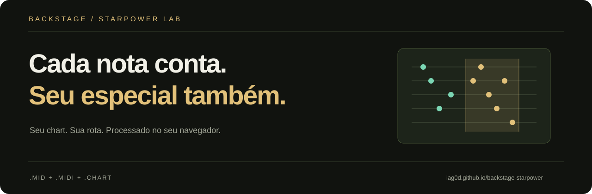

<p align="center"></p>

<p align="center"><a href="https://iag0d.github.io/backstage-starpower/">Abrir o analisador</a> · <a href="#como-usar">Como usar</a> · <a href="#precisão-e-limitações">Precisão e limitações</a></p>

# Backstage StarPower

Seu chart. Sua rota. Mais intenção em cada ativação.

Planejador visual e experimental de **Star Power para charts de cinco frets do Clone Hero**. Importe um `.mid`, `.midi` ou `.chart` e receba uma rota estimada com horário, compasso, nota de referência e barra necessária. Gratuito, sem instalação, sem conta e sem backend.

> **Não é um otimizador exato nem uma garantia de recorde.** O motor é próprio e aproximado; não é o CHOpt. Leia as limitações antes de comparar pontuações com o jogo.

## Como usar

1. Abra **[o site](https://iag0d.github.io/backstage-starpower/)** e selecione o arquivo de notas da música, ou use **Carregar demo**.
2. Escolha instrumento e dificuldade disponíveis no arquivo.
3. Selecione a estratégia e se deseja considerar whammy.
4. Consulte o mapa e a lista de ativações. **Baixar PNG** exporta um resumo para consultar durante o treino.

O cálculo começa ao importar e é atualizado ao mudar as opções. Uma análise pode ser cancelada; nesse caso, importe novamente para recomeçar.

### Estratégias

| Opção | Ganho de whammy considerado |
| --- | --- |
| Máxima estimada | 100% do ganho de sustain previsto pelo modelo |
| Conservadora | 70% do mesmo ganho, como margem de execução |
| Incluir whammy desligado | Apenas energia das frases |

As duas estratégias comparam guardar e ativar ao longo do chart. “Conservadora” não significa uma rota matematicamente robusta a qualquer erro. O site **não toca, não aciona especial no jogo e não envia pontuações**.

## O que é suportado

- MIDI musical PPQ, tipos 0 e 1, incluindo running status.
- `.chart`: guitarra, baixo, rhythm, co-op e teclas de cinco frets.
- MIDI: `PART GUITAR`, `T1 GEMS`, `PART BASS`, `PART RHYTHM`, `PART GUITAR COOP` e `PART KEYS`.
- Easy, Medium, Hard e Expert quando presentes no arquivo.
- Mudanças de BPM e de fórmula de compasso; acordes, sustains e notas abertas.
- Frases de especial: evento `S 2` no CHART, pitch 116 no MIDI; fallback legado para 103 com aviso.
- Enhanced Opens e regiões open de SysEx Phase Shift.
- Layout adaptável, processamento em Web Worker e exportação de PNG.
- Visual roxo/azul neon, pista animada e transições leves, sem bibliotecas adicionais. O botão **Pausar** interrompe os efeitos; a preferência de movimento reduzido do sistema é respeitada automaticamente.

**Não suportado:** bateria, pro instruments, seis frets, áudio, playlists, ZIP/SNG e song.ini. Use o arquivo de notas já extraído. O demo “Neon Run” é sintético e original deste projeto, sem música comercial.

## Precisão e limitações

O algoritmo usa programação dinâmica sobre uma linha do tempo com passos de 1/16 de beat, fronteiras exatas de notas, tempos e compassos, e 256 divisões de energia com interpolação. Em cada estado, compara o ganho futuro de guardar ou ativar. A rota é reconstruída com energia contínua; discretização e interpolação podem afetar o resultado.

Premissas do modelo:

- Todas as notas são acertadas, sem overstrums e com combo mantido.
- Nota-base de 50 pontos, multiplicador até 4×, especial dobrando a pontuação modelada; bônus de execução limpa de 2 pontos por grupo de notas.
- Cada frase válida concede 1/4 de barra; ativação exige ao menos meia barra; barra inteira dura oito compassos sem ganho adicional.
- Sustains concedem pontos continuamente usando um intervalo derivado de `floor(resolução / 25)`; acordes de duração igual contam um sustain, durações diferentes são contabilizadas separadamente.
- Whammy ideal gera 1/30 de barra por beat de sustain especial. Sobreposições não multiplicam o ganho.

Diferenças importantes em relação ao jogo:

- **Não modela squeezes, early/late hits, early whammy nem whammy bursts do CH 1.1.**
- Não reproduz arredondamento por sustain, burst dos últimos ticks, todas as regras de extended sustains, corte de sustains ou opções do perfil.
- Bônus de solo não é incluído na estimativa de pontuação.
- Não lê regras do `song.ini`, velocidade da música, calibração ou modificadores. O marcador 103 pode ter outro significado em charts específicos.
- Não aplica `Offset` ou anchors de áudio: os horários são relativos ao chart. Para MIDI, o título exibido é o nome do arquivo.
- Contagem de notas soma frets dos acordes; a **nota de referência** numera grupos simultâneos, não cada fret. Pode diferir do contador do jogo.
- Arquivos limitados a 20 MB, 256 trilhas MIDI, 1 milhão de eventos MIDI, 100 mil notas por trilha, 16 mil beats e 100 mil eventos de planejamento. Charts extensos podem atingir primeiro o limite de planejamento.

Os testes cobrem parsing, validação de entrada e cenários do modelo; **não constituem validação integral contra o Clone Hero ou o CHOpt**. Use a rota como ponto de partida e confira no treino. Melhorias de precisão devem vir acompanhadas de casos reproduzíveis e comparação com um motor de referência.

### Comparação reproduzível da demo

Demo original `assets/neon-run.chart`, guitarra Expert, CHOpt CLI **1.16.2**, engine `ch`, squeeze e early whammy em zero:

| Resultado | Backstage, máxima estimada | CHOpt |
| --- | ---: | ---: |
| Sem especial | 67.452 | 67.455 |
| Com a rota planejada | 114.852 | 115.255 |

Diferença observada: **403 pontos (cerca de 0,35%)** no total deste exemplo. Isso não é uma margem garantida para outros charts. A rota retornada pelo CHOpt foi `3(+1)-2(+2)`.

```sh
CHOpt --file assets/neon-run.chart --engine ch --squeeze 0 --early-whammy 0 --no-image
```

## Privacidade

O arquivo selecionado é lido em memória no navegador e processado em um Web Worker. Não há upload para servidor, analytics, cookies próprios, cadastro ou persistência do chart. Ao recarregar a página, ele precisa ser importado novamente.

O GitHub Pages recebe as requisições normais para servir o site, seus recursos e, se solicitada, a demo. Isso não inclui o conteúdo do seu arquivo importado. Nenhum chart de terceiros é incluído neste repositório.

## Rodar e testar localmente

Requer **Node.js 22 ou superior**. Sem dependências para instalar.

```sh
git clone https://github.com/IaG0D/backstage-starpower.git
cd backstage-starpower
npm test
npm start
```

Abra `http://127.0.0.1:4173`. Não abra `index.html` via `file://`: módulos e Web Worker precisam de HTTP. O servidor local serve apenas para desenvolvimento.

```text
index.html / style.css / app.js   Interface, mapa e exportação
worker.js                        Processamento fora da interface
lib/parser.js                    Leitura e validação dos formatos
lib/optimizer.js                 Modelo e planejamento aproximado
assets/                          Identidade visual e demo original
tests/core.test.mjs               Testes nativos do Node
tools/serve.mjs                   Servidor estático de desenvolvimento
```

## Publicação no GitHub Pages

Sem build: publique a raiz da branch `main` em **Settings → Pages → Deploy from a branch**. Os caminhos são relativos, portanto o site funciona no subdiretório do repositório. `.nojekyll` evita processamento desnecessário. O workflow de CI executa os testes a cada push ou pull request.

## Referências

- [GuitarGame Chart Formats](https://github.com/TheNathannator/GuitarGame_ChartFormats): documentação comunitária dos formatos, trilhas MIDI e extensões.
- [CHOpt](https://github.com/GenericMadScientist/CHOpt): referência de otimização e regras de pontuação. Este projeto **não incorpora nem executa o motor CHOpt**.
- [GitHub Pages](https://docs.github.com/en/pages/getting-started-with-github-pages/what-is-github-pages): hospedagem estática.

Projeto independente de [IaG0D](https://github.com/IaG0D), sem afiliação com a equipe do Clone Hero. Código e assets originais sob [licença MIT](LICENSE).
